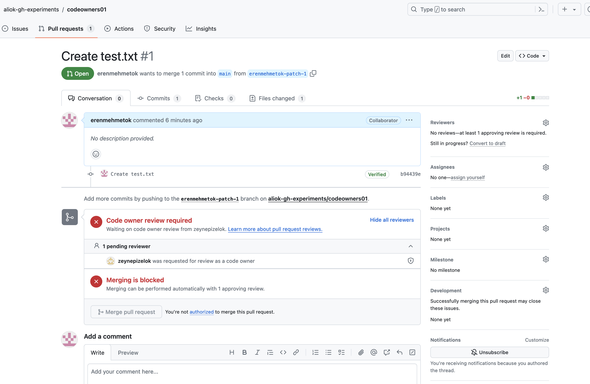
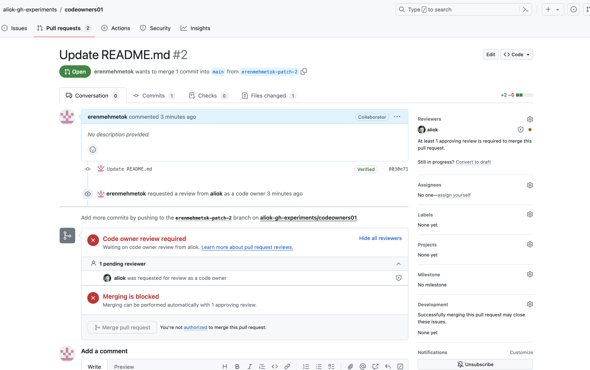

## Experimenting with GitHub's CODEOWNERS file

Target:
- Being able to limit people to approve PRs in a specific directory

Notes:
- CODEOWNERS feature requires people to have "write" access to the repository
- Using the GitHub Settings app, we can maintain the list of "collaborators" (in GitHub settings), so that people can have the write access. (they need to accept the invite)
- Adding people to the org might have been an option, but it means they can create repositories in the org. So, it is a no-go.
- See https://docs.github.com/en/repositories/managing-your-repositorys-settings-and-features/customizing-your-repository/about-code-owners
- That means they can push to the repository. So, we need branch protection rules to prevent them from pushing to the other places in the repository. In branch protection, we can specify that no one can push to the main branch directly, but only through PRs. And in PRs, we can specify that only the CODEOWNERS can approve the PRs.
- The branch protection rules in `.github` repository are inherited and they work fine. (state: https://github.com/aliok-gh-experiments/.github/blob/e1991de5e85f7681da2c70075fb8a5f03e447eeb/.github/settings.yml)

Screenshots

### User1 has write access to the repository, but not a CODEOWNER of the testdir02 directory

### User1 has write access to the repository, but not a CODEOWNER for the whole repository

